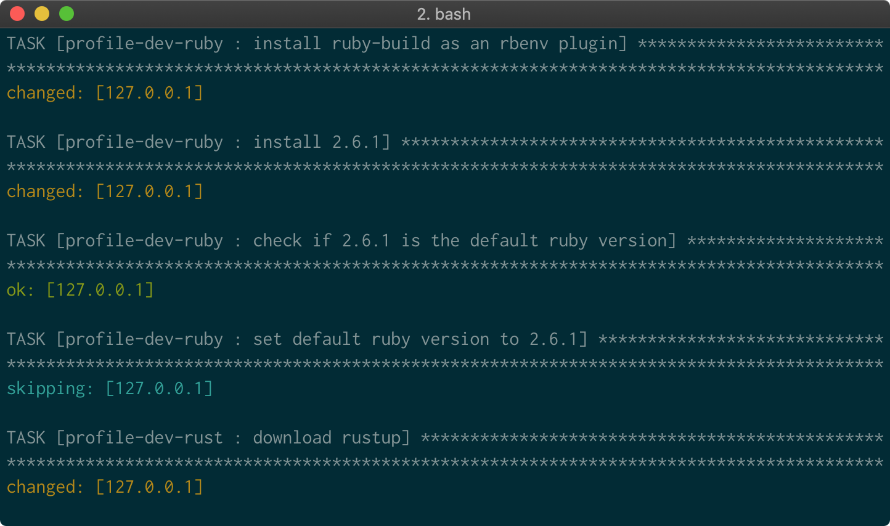

# Set Up macOS

This [Ansible](https://www.ansible.com/) playbook installs and configures most of the stuff I use on macOS.



## Usage

Install command line tools for Xcode:

```sh
xcode-select --install
```

Then run:

```sh
./install.sh
```

To change the default shell back to `bash`, run:

```sh
sudo sh -c 'echo /opt/homebrew/bin/bash >> /etc/shells'
chsh -s /opt/homebrew/bin/bash
```

## Meta

- Code: `git clone git@github.com:unindented/setup-macos.git`
- Home: <https://github.com/unindented/setup-macos>

## Contributors

Daniel Perez Alvarez ([daniel@unindented.org](mailto:daniel@unindented.org))

## License

Copyright (c) 2023 Daniel Perez Alvarez ([unindented.org](https://unindented.org/)). This is free software, and may be redistributed under the terms specified in the LICENSE file.
